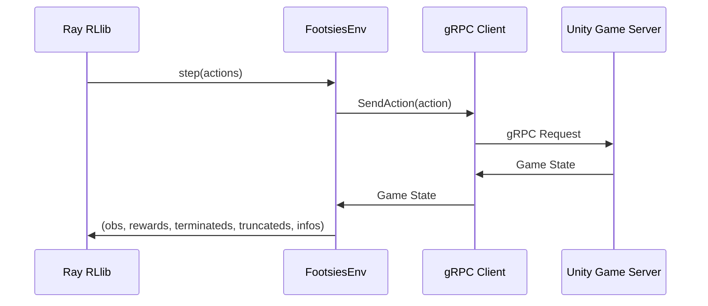

# FootsiesGym

<p align="center">
  
</p>

A reinforcement learning environment for HiFight's [Footsies](https://hifight.github.io/footsies/) game. This environment serves as a benchmark for multi-agent reinforcement learning in a two-player zero-sum fighting game.

The environment wraps the open-source Unity implementation, augmented with a gRPC server controlled through a Python harness. Training is implemented using Ray's [RLlib](https://docs.ray.io/en/latest/rllib/index.html).

## Installation

```bash
pip install footsies-gym
```

Or install from source:

```bash
git clone https://github.com/chasemcd/FootsiesGym.git
cd FootsiesGym
pip install -e .
```

Game binaries are downloaded automatically on first use from a CDN and verified with SHA256 checksums. No manual binary setup is required.

## Quick Start

```python
import footsiesgym
from footsiesgym.footsies.game import constants

# Create environment (downloads binaries automatically)
env = footsiesgym.make(platform="linux")

obs, infos = env.reset()

while True:
    actions = {agent: env.action_space[agent].sample() for agent in env.agents}
    obs, rewards, terminateds, truncateds, infos = env.step(actions)

    if terminateds["__all__"] or truncateds["__all__"]:
        obs, infos = env.reset()
```

> **Note:** `launch_binaries=True` (the default) only works on Linux. On macOS, launch the game server manually and pass `launch_binaries=False` (see [Platform Support](#platform-support)).

## System Architecture



## Configuration

### Creating an Environment

Use `footsiesgym.make()` for a quick setup with sensible defaults:

```python
env = footsiesgym.make(
    config={...},           # Override default config keys (see below)
    platform="linux",       # "linux" or "mac"
    launch_binaries=True,   # Auto-launch game server (Linux only)
)
```

Or create the environment directly for full control:

```python
from footsiesgym import FootsiesEnv

env = FootsiesEnv(config={...})
```

### Config Options

| Key | Type | Default | Description |
|-----|------|---------|-------------|
| `max_t` | int | `4000` | Maximum timesteps per episode |
| `frame_skip` | int | `4` | Number of game frames per environment step |
| `action_delay` | int | `8` | Action delay in frames (must be divisible by `frame_skip`) |
| `port` | int | auto | gRPC port for game server communication |
| `host` | str | `"localhost"` | Game server host address |
| `headless` | bool | `True` | Headless mode (True) or windowed (False) |
| `launch_binaries` | bool | `False` | Auto-launch game binaries (Linux only) |
| `platform` | str | `"linux"` | Target platform (`"linux"` or `"mac"`) |
| `evaluation` | bool | `False` | Evaluation mode flag |
| `use_special_charge_action` | bool | `False` | Enable the `SPECIAL_CHARGE` toggle action |
| `return_fight_state_in_infos` | bool | `False` | Include detailed fight state in `infos` dict |
| `win_reward_scaling_coeff` | float | `1.0` | Scales the win/loss reward magnitude |
| `guard_break_reward` | float | `0.0` | Reward given per guard break event |
| `use_reward_budget` | bool | `False` | Deduct guard break rewards from the win reward budget |

## Action Space

Each agent selects from a `Discrete` action space:

| Action | ID | Description |
|--------|----|-------------|
| `NONE` | 0 | No input |
| `BACK` | 1 | Move backward |
| `FORWARD` | 2 | Move forward |
| `ATTACK` | 3 | Attack |
| `BACK_ATTACK` | 4 | Back + Attack |
| `FORWARD_ATTACK` | 5 | Forward + Attack |
| `SPECIAL_CHARGE` | 6 | Toggle special charge (only when `use_special_charge_action=True`) |

The action space is `Discrete(6)` by default, or `Discrete(7)` with `use_special_charge_action=True`.

### Special Charge Mechanic

When `use_special_charge_action=True`, agents can hold the attack button to charge a special attack (requires 60 frames / 15 steps at `frame_skip=4`). `SPECIAL_CHARGE` is a toggle: activating it holds the attack input, and all movement actions become their attack variants (e.g., `FORWARD` becomes `FORWARD_ATTACK`). Toggle again to release.

### Action Delay

Actions are queued and executed after `action_delay // frame_skip` steps. This simulates reaction time and makes the environment more realistic.

## Observation Space

Each agent receives a `Box` observation of shape `(86,)` containing:

| Component | Size | Description |
|-----------|------|-------------|
| Common state | 1 | Normalized distance between players |
| Self player state | 40 | Position, velocity, health, action state, and **privileged features** (dash readiness, special progress, previous action, charge state) |
| Opponent state | 45 | Same as self but **without** privileged features |

Observations are asymmetric: each agent sees its own privileged information but not the opponent's.

## Rewards

Rewards are **zero-sum** between the two agents (`rewards["p1"] + rewards["p2"] == 0`).

| Signal | When | Value |
|--------|------|-------|
| **Win/Loss** | Opponent dies | `+/- win_reward_scaling_coeff` (minus any budget spent on guard breaks) |
| **Guard break** | Opponent's guard decreases | `+/- guard_break_reward` (up to 3 times per episode) |

When `use_reward_budget=True`, guard break rewards are deducted from the win reward so total reward per episode is capped at `win_reward_scaling_coeff`. When `False`, guard break rewards are additive.

## Platform Support

| Platform | Auto-launch | Manual launch |
|----------|-------------|---------------|
| **Linux** | `launch_binaries=True` | Supported |
| **macOS** | Not supported | Supported |
| **Windows** | Not supported | TBD |

### macOS Setup

Launch the game server manually, then create the environment:

```bash
# Extract and run the headless binary
./footsies_mac_headless_5709b6d --port 50051
```

```python
env = footsiesgym.make(
    config={"port": 50051, "headless": True},
    platform="mac",
    launch_binaries=False,
)
```

### Binary Management

Binaries are automatically downloaded from a CDN (`footsiesgym.chasemcd.com`) on first use, with GitHub as a fallback source. All downloads are verified with SHA256 checksums. File locking prevents race conditions when multiple processes download simultaneously.

> **Offline usage:** The binaries must be downloaded at least once before running offline. The easiest way to ensure this is to run the environment once while online so the binaries are automatically downloaded and cached.

## Training

Training uses Ray RLlib with the [APPO](https://docs.ray.io/en/latest/rllib/rllib-algorithms.html#appo) algorithm.

### Launching Game Servers (manual)

If not using `launch_binaries=True`, start servers before training:

```bash
./scripts/start_local_{mac,linux}_servers.sh <num-train-servers> <num-eval-servers>
```

Training servers start from port 50051, evaluation servers from port 40051.

### Running Training

```bash
python -m experimentation.train --experiment-name <experiment-name>

# Local debug mode (single env runner)
python -m experimentation.train --experiment-name <experiment-name> --debug
```

## Visualizing a Policy

1. Launch the windowed game binary:
   ```bash
   ./footsies_linux_windowed_021725 --port 80051
   ```

2. Register your trained policy in `components/module_repository.py`:
   ```python
   FootsiesModuleSpec(
       module_name="<policy-nickname>",
       experiment_name="<experiment-name>",
       trial_id="<trial-id>",
       checkpoint_number=-1,  # -1 for latest
   )
   ```

3. Configure policies in `scripts/local_inference.py`. Set `"p1"` to `"human"` to play against the AI (requires `pygame`).

## Project Structure

```
FootsiesGym/
├── footsiesgym/           # Installable package
│   ├── footsies/          # Core environment, encoder, gRPC client
│   ├── binary_manager.py  # Binary download and hash verification
│   └── __init__.py        # Package entry point with make()
├── experimentation/       # Training configurations and scripts
├── binaries/              # Game server binaries (downloaded automatically)
├── callbacks/             # RLlib callbacks
├── components/            # Module repository for policy management
├── models/                # Neural network architectures
├── scripts/               # Server launch and inference scripts
├── testing/               # Tests
└── utils/                 # Utility functions
```

## Development

### gRPC / Protobuf Updates

If updating the proto definitions:

```bash
# Generate Python files
python -m grpc_tools.protoc -I. --python_out=. --grpc_python_out=. footsiesgym/footsies/game/proto/footsies_service.proto
```

### Running Tests

```bash
pip install -e ".[dev]"
pytest
```

## License

This project is based on the open-source Footsies game by HiFight. See the original game's license for details.
