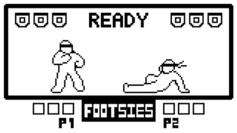
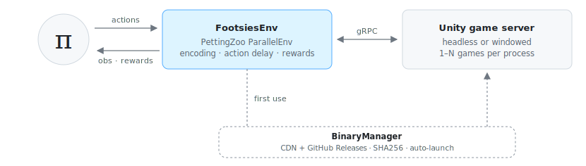
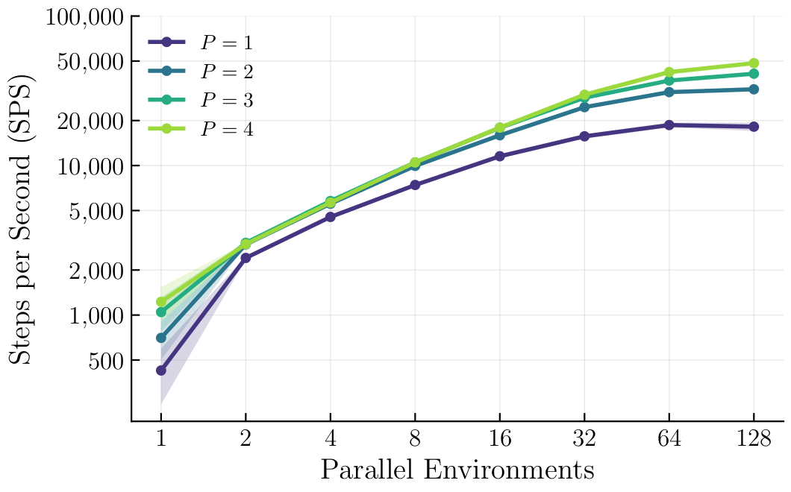
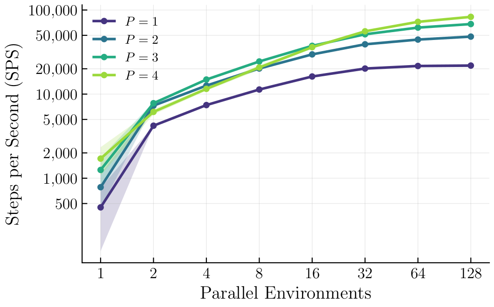

# FootsiesGym

<p align="left">
  <a href="https://arxiv.org/abs/2607.06514"></a>
</p>

<p align="center">
  
</p>

A reinforcement learning environment for HiFight's [Footsies](https://hifight.github.io/footsies/) game. This environment serves as a benchmark for multi-agent reinforcement learning in a two-player zero-sum fighting game. For a full description, see: [FootsiesGym: A Fighting Game Benchmark for Two-Player Zero-Sum Imperfect-Information Games](https://arxiv.org/abs/2607.06514).

The environment wraps the open-source Unity implementation, augmented with a gRPC server controlled through a Python harness. Training is implemented using Ray's [RLlib](https://docs.ray.io/en/latest/rllib/index.html).

## Installation

```bash
uv add footsies-gym          # or: pip install footsies-gym
```

Or install from source:

```bash
git clone https://github.com/como-research/FootsiesGym.git
cd FootsiesGym
uv sync                      # or: pip install -e .
```

Game binaries are downloaded automatically on first use and verified with SHA256 checksums — no manual binary setup is required on Linux or macOS.

## Quick Start

```python
import footsiesgym
from footsiesgym.footsies.game import constants

# Create environment (downloads binaries automatically)
env = footsiesgym.make(platform="linux")

obs, infos = env.reset()

while True:
    actions = {agent: env.action_space[agent].sample() for agent in env.agents}
    obs, rewards, terminateds, truncateds, infos = env.step(actions)

    if terminateds["__all__"] or truncateds["__all__"]:
        obs, infos = env.reset()
```

> **Note:** `launch_binaries=True` (the default) works on Linux and macOS (on macOS the server runs under Rosetta and is re-signed automatically; see [Platform Support](#platform-support)). Windows is not supported.


## Configuration

### Creating an Environment

Use `footsiesgym.make()` for a quick setup with sensible defaults:

```python
env = footsiesgym.make(
    config={...},           # Override default config keys (see below)
    platform="linux",       # "linux" or "mac"
    launch_binaries=True,   # Auto-launch game server (Linux and macOS)
)
```

Or create the environment directly for full control:

```python
from footsiesgym import FootsiesEnv

env = FootsiesEnv(config={...})
```

### Config Options

| Key | Type | Default | Description |
|-----|------|---------|-------------|
| `max_t` | int | `4000` | Maximum timesteps per episode |
| `frame_skip` | int | `4` | Number of game frames per environment step |
| `action_delay` | int | `8` | Action delay in frames (must be divisible by `frame_skip`) |
| `port` | int | auto | gRPC port for game server communication |
| `host` | str | `"localhost"` | Game server host address |
| `headless` | bool | `True` | Headless mode (True) or windowed (False) |
| `launch_binaries` | bool | `False` | Auto-launch game binaries (Linux and macOS) |
| `platform` | str | `"linux"` | Target platform (`"linux"` or `"mac"`) |
| `evaluation` | bool | `False` | Evaluation mode flag |
| `use_special_charge_action` | bool | `False` | Enable the `SPECIAL_CHARGE` toggle action |
| `return_fight_state_in_infos` | bool | `False` | Include detailed fight state in `infos` dict |
| `win_reward_scaling_coeff` | float | `1.0` | Scales the win/loss reward magnitude |
| `guard_break_reward` | float | `0.0` | Reward given per guard break event |
| `use_reward_budget` | bool | `False` | Deduct guard break rewards from the win reward budget |

## Action Space

Each agent selects from a `Discrete` action space:

| Action | ID | Description |
|--------|----|-------------|
| `NONE` | 0 | No input |
| `BACK` | 1 | Move backward |
| `FORWARD` | 2 | Move forward |
| `ATTACK` | 3 | Attack |
| `BACK_ATTACK` | 4 | Back + Attack |
| `FORWARD_ATTACK` | 5 | Forward + Attack |
| `SPECIAL_CHARGE` | 6 | Toggle special charge (only when `use_special_charge_action=True`) |
| `FORWARD_SPECIAL_CHARGE` | 7 | Move forward while toggling special charge (only when `use_special_charge_action=True`) |
| `BACK_SPECIAL_CHARGE` | 8 | Move backward while toggling special charge (only when `use_special_charge_action=True`) |

The action space is `Discrete(6)` by default, or `Discrete(9)` with `use_special_charge_action=True`.

### Special Charge Mechanic

When `use_special_charge_action=True`, agents can hold the attack button to charge a special attack (requires 60 frames / 15 steps at `frame_skip=4`). `SPECIAL_CHARGE` is a toggle: activating it holds the attack input, and all movement actions become their attack variants (e.g., `FORWARD` becomes `FORWARD_ATTACK`). Toggle again to release.

### Action Delay

Actions are queued and executed after `action_delay // frame_skip` steps. This simulates reaction time and makes the environment more realistic.

## Observation Space

Each agent receives a `Box` observation of shape `(88,)` containing:

| Component | Size | Description |
|-----------|------|-------------|
| Common state | 1 | Normalized distance between players |
| Self player state | 50 | 37 public features (position, velocity, health, guard, action state) plus 13 **privileged features**: dash readiness (2), special attack progress (1), previous action one-hot (9), and charge state (1) |
| Opponent state | 37 | The public features only — **no** privileged features |

Observations are asymmetric: each agent sees its own privileged information but not the opponent's.

## Rewards

Rewards are **zero-sum** between the two agents (`rewards["p1"] + rewards["p2"] == 0`).

| Signal | When | Value |
|--------|------|-------|
| **Win/Loss** | Opponent dies | `+/- win_reward_scaling_coeff` (minus any budget spent on guard breaks) |
| **Guard break** | Opponent's guard decreases | `+/- guard_break_reward` (up to 3 times per episode) |

When `use_reward_budget=True`, guard break rewards are deducted from the win reward so total reward per episode is capped at `win_reward_scaling_coeff`. When `False`, guard break rewards are additive.

## Platform Support

| Platform | Supported? | Auto-launch | Manual launch |
|----------|------------|-------------|---------------|
| **Linux** |   Yes | `launch_binaries=True` | Supported |
| **macOS** |     Yes     | `launch_binaries=True` | Supported |
| **Windows** |    No   | --- | --- |

### Manual Launch

Binaries are downloaded, extracted, re-signed (ad-hoc), and launched automatically, just like on Linux — the game server runs under Rosetta since gRPC (Grpc.Core) is x86_64-only:

```python
env = footsiesgym.make(platform="mac")
```

To launch the game server manually instead, download the binaries from the CDN or the [`binaries-v1` GitHub release](https://github.com/como-research/FootsiesGym/releases/tag/binaries-v1):

```bash
curl -LO https://footsiesgym.chasemcd.com/v0.7.0/footsies_mac_headless_bbdb506.zip
# or: gh release download binaries-v1 --repo como-research/FootsiesGym --pattern "footsies_mac_*"

unzip footsies_mac_headless_bbdb506.zip
arch -x86_64 footsies_mac_headless_bbdb506/FOOTSIES --port 50051 -batchmode --grpc
```

If macOS reports "This will damage your computer," re-sign the binary:

```bash
codesign --force --deep --sign - footsies_mac_headless_bbdb506/FOOTSIES
```

Then create the environment against the running server:

```python
env = footsiesgym.make(
    config={"port": 50051, "headless": True},
    platform="mac",
    launch_binaries=False,
)
```

### Binary Management

All binaries are hosted on a CDN (`footsiesgym.chasemcd.com`), with [GitHub Releases](https://github.com/como-research/FootsiesGym/releases) as a fallback source, and are downloaded automatically on first use. Downloads are verified with SHA256 checksums.

> **Offline usage:** The binaries must be downloaded at least once before running offline. The easiest way to ensure this is to run the environment once while online so the binaries are automatically downloaded and cached.

## Training

> [!NOTE]
> The code for the experiments from [the corresponding paper](https://arxiv.org/abs/2607.06514) is coming soon; it was not run through the RLlib or CleanRL examples provided.

Training uses Ray RLlib with the [APPO](https://docs.ray.io/en/latest/rllib/rllib-algorithms.html#appo) algorithm.

### Training

#### RLlib

Two RLlib training stacks are available: the newer RLModule-based stack and the
legacy ModelV2-based stack.

```bash
# RLModule stack (recommended)
python -m experimentation.experiments.rllib.train_rlmodule --experiment-name <experiment-name>

# Legacy ModelV2 stack
python -m experimentation.experiments.rllib.train --experiment-name <experiment-name>

# Local debug mode (single env runner)
python -m experimentation.experiments.rllib.train_rlmodule --experiment-name <experiment-name> --debug
```


#### CleanRL

A self-contained [CleanRL PPO example](experimentation/experiments/cleanrl/) is
also included.

## System Architecture

<p align="center">
  <picture>
    <source media="(prefers-color-scheme: dark)" srcset="assets/architecture-dark.svg">
    
  </picture>
</p>

Solid arrows are the per-step data flow; dotted arrows run once, on first use. The environment steps the game `frame_skip` frames per call, and in vectorized mode (`num_envs > 1`) a single server hosts N games stepped in one batched RPC.


## Throughput

<table align="center">
  <tr>
    <td align="center" width="50%"></td>
    <td align="center" width="50%"></td>
  </tr>
  <tr>
    <td align="center"><b>Linux</b></td>
    <td align="center"><b>macOS</b></td>
  </tr>
</table>

Environment steps per second vs. number of parallel environments, with $P$ concurrent game-server processes. See [`benchmarking/`](benchmarking/) to reproduce these results. When increasing $P$, we launch additional game servers. For example, $P=2$ launches the Footsies game binary twice. The number of parallel environments corresponds to the `num_envs` environment configuration paramer.


## Development

The project is managed with [uv](https://docs.astral.sh/uv/):

```bash
uv sync --all-extras         # create the venv with all extras
uv run pytest                # run the test suite (-m "not slow" to skip server tests)
uv build                     # build sdist + wheel
uv publish                   # publish to PyPI
```

## Citation

If you use FootsiesGym in your research, please cite:

```bibtex
@article{mcdonald2026footsies,
  title={FootsiesGym: A Fighting Game Benchmark for Two-Player
               Zero-Sum Imperfect-Information Games},
  author    = {McDonald, Chase and Tsang, Nathan and Kerr, Wesley N.},
  journal={arXiv preprint arXiv:2607.06514},
  year={2026}
}
```

## License

This project is licensed under the [GNU General Public License v3.0](LICENSE.txt).

FootsiesGym is based on the open-source [Footsies](https://github.com/hifight/Footsies) game by HiFight.
