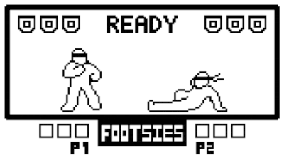
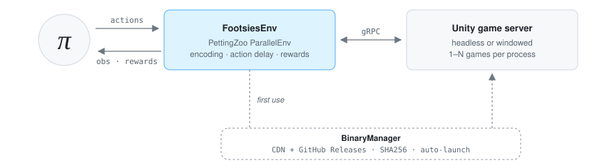
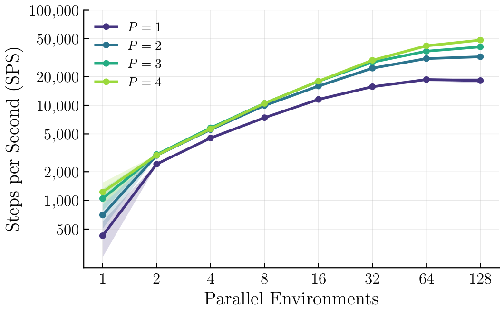
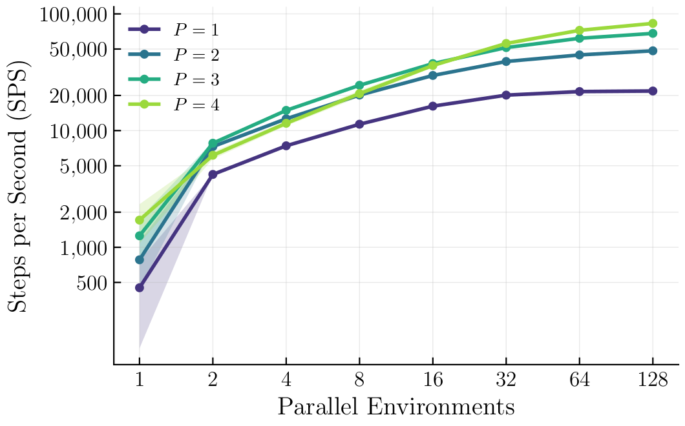

# FootsiesGym

<p align="left">
  <a href="https://arxiv.org/abs/2607.06514"></a>
</p>

<p align="center">
  
</p>

A two-player zero-sum reinforcement learning benchmark built on HiFight's [Footsies](https://hifight.github.io/footsies/) fighting game. See the paper: [FootsiesGym: A Fighting Game Benchmark for Two-Player Zero-Sum Imperfect-Information Games](https://arxiv.org/abs/2607.06514).

The environment is a PettingZoo `ParallelEnv` that runs the game in one of two backends:

- **Unity** (default): the original game, driven over gRPC. Binaries download automatically.
- **JAX**: a bit-identical port of the game in JAX that runs in-process, can be jitted and vmapped, and reaches millions of steps per second on a GPU.

## Installation

FootsiesGym requires Python 3.12 or newer.

```bash
pip install footsies-gym           # or: uv add footsies-gym
pip install "footsies-gym[jax]"    # with the JAX backend
```

From source:

```bash
git clone https://github.com/como-research/FootsiesGym.git
cd FootsiesGym
uv sync --all-extras               # or: pip install -e ".[all]"
```

## Quick Start

```python
import footsiesgym

env = footsiesgym.make()           # downloads and launches the game server

obs, infos = env.reset()
while True:
    actions = {agent: env.action_space(agent).sample() for agent in env.agents}
    obs, rewards, terminateds, truncateds, infos = env.step(actions)
    if terminateds["p1"] or truncateds["p1"]:
        obs, infos = env.reset()
```

With `num_envs > 1` a single Unity server runs N games, and every value becomes an array with a leading `num_envs` axis. Finished games reset automatically inside `step()`:

```python
env = footsiesgym.make(config={"num_envs": 64})
```

To use the JAX backend, pass `backend="jax"`. No binaries are needed; for batched training, use the functional `FootsiesJaxEnv` (see [JAX Backend](#jax-backend)):

```python
env = footsiesgym.make(backend="jax")
```

## Architecture

<p align="center">
  <picture>
    <source media="(prefers-color-scheme: dark)" srcset="assets/architecture-dark.svg">
    
  </picture>
</p>

Solid arrows are the per-step data flow; dotted arrows run once, on first use. Each `step()` advances the game `frame_skip` frames. With `num_envs > 1`, all games are stepped in one batched RPC.

## Configuration

Pass options as `footsiesgym.make(config={...})`:

| Key | Default | Description |
|-----|---------|-------------|
| `num_envs` | `1` | Number of parallel games on one Unity server (vectorized mode when > 1) |
| `max_t` | `4000` | Steps per episode before truncation |
| `frame_skip` | `4` | Game frames per step |
| `action_delay` | `8` | Frames before a selected action executes (multiple of `frame_skip`) |
| `use_special_charge_action` | `False` | Add the special-charge toggle actions (6-8) |
| `win_reward_scaling_coeff` | `1.0` | Win/loss reward magnitude |
| `guard_break_reward` | `0.0` | Reward per guard break |
| `use_reward_budget` | `False` | Deduct guard-break rewards from the win reward |
| `return_fight_state_in_infos` | `False` | Add fight-state details to `infos` (single-env mode) |
| `headless` | `True` | Run the Unity server headless or windowed |
| `port`, `host` | auto, `"localhost"` | gRPC address of the Unity server |

`make()` also takes `backend` (`"grpc"` for the Unity server, `"jax"` for the [JAX port](#jax-backend)), `platform` (`"linux"` or `"mac"`) and `launch_binaries` (default `True`).

## Actions

Each agent picks from `Discrete(6)`, or `Discrete(9)` with `use_special_charge_action=True`:

| ID | Action | ID | Action |
|----|--------|----|--------|
| 0 | `NONE` | 5 | `FORWARD_ATTACK` |
| 1 | `BACK` | 6 | `SPECIAL_CHARGE` |
| 2 | `FORWARD` | 7 | `FORWARD_SPECIAL_CHARGE` |
| 3 | `ATTACK` | 8 | `BACK_SPECIAL_CHARGE` |
| 4 | `BACK_ATTACK` | | |

- **Special charge.** A special attack requires holding attack for 60 frames (15 steps at `frame_skip=4`). The `SPECIAL_CHARGE` actions toggle a held attack button: while it's held, movement actions become their attack variants (`FORWARD` → `FORWARD_ATTACK`). Toggling again releases the attack.
- **Action delay.** Actions execute `action_delay // frame_skip` steps after they are selected, which simulates reaction time.

## Observations

Each agent gets a `Box` of shape `(88,)`:

| Part | Size | Contents |
|------|------|----------|
| Common | 1 | Distance between the players |
| Self | 50 | 37 public features (position, velocity, health, guard, action state) and 13 privileged ones: dash readiness (2), special-attack progress (1), previous action (9), charge state (1) |
| Opponent | 37 | Public features only |

## Rewards

Rewards are zero-sum (`rewards["p1"] + rewards["p2"] == 0`):

| Event | Reward |
|-------|--------|
| Opponent dies | `± win_reward_scaling_coeff` |
| Opponent's guard breaks | `± guard_break_reward` (at most 3 times per episode) |

With `use_reward_budget=True`, guard-break rewards are deducted from the win reward, so an episode's total reward never exceeds `win_reward_scaling_coeff`.

## JAX Backend

`footsiesgym.jax` is a port of the game's simulation (Unity's `BattleSimulation` and `Fighter`, with frame data extracted from the Unity assets). Its observations, rewards and done flags are bit-identical to the Unity game's, so a policy trained on it plays the same in the real game.

`FootsiesJaxEnv` is the functional environment: pure `reset`/`step` functions of an explicit state, with dicts keyed by agent (`"p1"`, `"p2"`). It follows the API of [Sardine](https://github.com/RiotGames/sardine) (and JaxMARL / CoGrid), so it can be passed straight to a Sardine experiment as `env=FootsiesJaxEnv`. For one game, obs are `(88,)` and rewards and done flags are scalars. `vectorize(num_envs)` (or `jax.vmap`) runs many games and adds a leading `(num_envs,)` axis to every value:

```python
import jax
from footsiesgym.jax import FootsiesJaxEnv

env = FootsiesJaxEnv(frame_skip=4, action_delay=8).vectorize(4096)
obs, state, infos = jax.jit(env.reset)(jax.random.key(0))       # obs["p1"]: (4096, 88)
obs, state, rewards, terminateds, truncateds, infos = jax.jit(env.step)(key, state, actions)
# actions = {"p1": int[4096], "p2": int[4096]}; rewards["p1"]: (4096,)
```

`make(backend="jax")` returns a regular single-game `FootsiesEnv` (`reset()`/`step()` as in the Quick Start); its `jax_env` is the `FootsiesJaxEnv` above.

Notes:
- `step` resets a finished game itself: the returned obs and state come from a fresh game, and the rewards and done flags from the episode that ended. `step_env` is the same step without the reset.
- Rewards are float32 (the float64 value rounded once) unless `jax_enable_x64` is on.
- Parity with the Unity binary is tested frame by frame (`testing/test_jax_backend.py`). For a larger check, run `python -m footsiesgym.jax.validation`. Unlike a fresh reset, Unity's vectorized server keeps a few fighter fields (hit stun, frame advantage, proximity-guard flags) from the previous episode when it resets a game.
- Unity's Mono runtime does float math in double precision. The port reproduces it with float32 arithmetic only, so it is exact on every JAX backend.
- After changing the Unity assets, regenerate the frame data with `python scripts/extract_unity_frame_data.py <path-to-FootsiesV2>`.

## Game Server

Binaries are hosted on a CDN (`footsiesgym.chasemcd.com`) with [GitHub Releases](https://github.com/como-research/FootsiesGym/releases) as a fallback. They are downloaded on first use, verified with SHA256 checksums and cached, so you need to be online the first time you run.

The server runs on Linux and macOS; Windows is not supported. On macOS it is re-signed automatically and runs under Rosetta, because Grpc.Core is x86_64-only.

To run the server yourself, download a build from the CDN or the [`binaries-v1` release](https://github.com/como-research/FootsiesGym/releases/tag/binaries-v1), start it, and point the environment at its port:

```bash
curl -LO https://footsiesgym.chasemcd.com/v0.7.0/footsies_mac_headless_bbdb506.zip
unzip footsies_mac_headless_bbdb506.zip
codesign --force --deep --sign - footsies_mac_headless_bbdb506/FOOTSIES   # macOS, if it refuses to start
arch -x86_64 footsies_mac_headless_bbdb506/FOOTSIES --port 50051 -batchmode --grpc
```

```python
env = footsiesgym.make(config={"port": 50051}, launch_binaries=False)
```

## Training

> [!NOTE]
> The code for the paper's experiments is coming soon. Those experiments were not run with the examples below.

- **RLlib** ([APPO](https://docs.ray.io/en/latest/rllib/rllib-algorithms.html#appo)), with the RLModule stack (recommended) or the legacy ModelV2 stack:

  ```bash
  python -m experimentation.experiments.rllib.train_rlmodule --experiment-name <name> [--debug]
  python -m experimentation.experiments.rllib.train --experiment-name <name>
  ```

- **CleanRL**: a self-contained [PPO example](experimentation/experiments/cleanrl/).

## Throughput

<table align="center">
  <tr>
    <td align="center" width="50%"></td>
    <td align="center" width="50%"></td>
  </tr>
  <tr>
    <td align="center"><b>Linux</b></td>
    <td align="center"><b>macOS</b></td>
  </tr>
</table>

Unity backend: environment steps per second against `num_envs`, with $P$ game-server processes running in parallel. The JAX backend reaches about 31M steps per second with 65,536 games on one RTX 3090. See [`benchmarking/`](benchmarking/) to reproduce both.

## Development

```bash
uv sync --all-extras
uv run pytest                # add -m "not slow" to skip tests that launch the game server
uv build
```

## Citation

```bibtex
@article{mcdonald2026footsiesgym,
  title={FootsiesGym: A Fighting Game Benchmark for Two-Player Zero-Sum Imperfect-Information Games},
  author={McDonald, Chase and Tsang, Nathan and Kerr, Wesley N},
  journal={arXiv preprint arXiv:2607.06514},
  year={2026}
}
```

## License

[GNU General Public License v3.0](LICENSE.txt). FootsiesGym is based on the open-source [Footsies](https://github.com/hifight/Footsies) game by HiFight.
